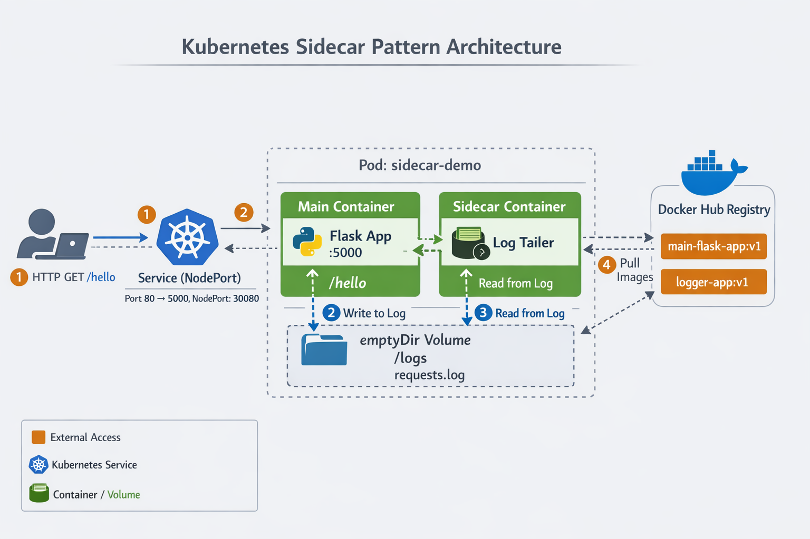

 

**Kubernetes Sidecar Pattern Demo**

    A practical demonstration of the Sidecar pattern in Kubernetes,
    featuring a Flask application with a logging sidecar container that monitors and streams application logs in real-time.
 
**Overview**

    This project demonstrates the Sidecar pattern - a fundamental Kubernetes design pattern
    where a helper container runs alongside the main application container within the same Pod. The sidecar container extends and enhances the functionality of the primary application without modifying its code.

In this implementation:

    Main Container: A Flask web application that logs incoming HTTP requests
    Sidecar Container: A Python logger that tails and streams the log file in real-time
    Shared Volume: An emptyDir volume that both containers use to share log data
    
    Before you begin, ensure you have the following installed:
    
    Docker (v20.10 or higher)
    Kubernetes cluster (Minikube, Kind, or any K8s cluster)
    kubectl CLI tool
    Docker Hub account (or any container registry)
    Python 3.11 (for local testing, optional)

 Project Structure

    k8s-sidecar-demo/
          app/
            - Dockerfile (Main Flask app container)
            - main_app.py (Flask application code)
            - requirement.txt (Python dependencies)
          
          sidecar/
            - Dockerfile (Sidecar logger container)
            - logger.py (Log tailing script)
          
          k8s/
            - deployment.yml (Kubernetes Deployment manifest)
            - service.yml (Kubernetes Service manifest)

 Project Explanation

    Main Application (app/main_app.py)
    The Flask application exposes a /hello endpoint that:
    Receives HTTP GET requests
    Logs the timestamp and requester's IP address
    Writes logs to /logs/requests.log (shared volume)
    Returns a JSON response

Key Features:

    Endpoint: GET /hello
    Logging: Timestamps + IP addresses
    Shared volume: /logs
    Sidecar Logger (sidecar/logger.py)

The sidecar container:

    Waits for the log file to be created
    Continuously tails the log file
    Streams new log entries to stdout with [sidecar] prefix
    Runs independently alongside the main app
    Kubernetes Configuration
    Deployment (k8s/deployment.yml):

    Runs both containers in the same Pod
    Shares /logs directory via emptyDir volume
    Ensures containers can communicate through shared filesystem
    Service (k8s/service.yml):

Type: NodePort

    External access on port 30080
    Routes traffic to Flask app on port 5000

Deployment Steps

    Step 1: Build Docker Images
   
    # Build main Flask application image
    cd app
    docker build -t <YOUR_DOCKERHUB_USERNAME>/main-flask-app:v1 .
    
    # Build sidecar logger image
    cd ../sidecar
    docker build -t <YOUR_DOCKERHUB_USERNAME>/logger-app:v1 .
    Step 2: Push Images to Registry
 
    # Login to Docker Hub
    docker login
    
    # Push images

    docker push <YOUR_DOCKERHUB_USERNAME>/main-flask-app:v1
    docker push <YOUR_DOCKERHUB_USERNAME>/logger-app:v1
    Step 3: Update Kubernetes Manifests
    Update the image names in k8s/deployment.yml:
    
    yaml
    containers:
      - name: main-app
        image: <YOUR_DOCKERHUB_USERNAME>/main-flask-app:v1
        - name: sidecar-logger
          image: <YOUR_DOCKERHUB_USERNAME>/logger-app:v1

    Step 4: Deploy to Kubernetes

    # Apply deployment
    kubectl apply -f k8s/deployment.yml
    
    # Apply service
    kubectl apply -f k8s/service.yml

    # Verify deployment
    kubectl get pods
    kubectl get svc

Testing the Application

    Method 1: Port Forwarding (Recommended for Testing)
  
    # Forward service port to localhost
    kubectl port-forward --address 0.0.0.0 svc/sidecar-demo-svc 8080:80
    # In another terminal, test the endpoint
    curl http://localhost:8080/hello
    
    Method 2: NodePort Access

    # Get node IP
    kubectl get nodes -o wide
    
    # Access the service
    curl http://<NODE_IP>:30080/hello
    Expected Response
    json
    {
      "message": "Hello from main app"
    }
     Viewing Logs
Main Application Logs

    # Get pod name
    kubectl get pods
    
    # View main app logs
    kubectl logs <POD_NAME> -c main-app
    Sample Output:
    
    Starting Flask server on 0.0.0.0:5000
     * Serving Flask app 'main_app'
       * Debug mode: on
    Sidecar Logger Logs

    # View sidecar logs
    kubectl logs <POD_NAME> -c sidecar-logger
    Sample Output:
    
    [sidecar] 2026-01-19 10:30:45.123456 - Received request from 192.168.1.100
    [sidecar] 2026-01-19 10:31:12.789012 - Received request from 192.168.1.101
    Real-time Log Streaming

    # Follow logs in real-time
    kubectl logs -f <POD_NAME> -c sidecar-logger
 
How It Works

    Pod Creation: Kubernetes creates a Pod with two containers
    Volume Mount: Both containers mount the shared emptyDir volume at /logs
    Main App: Flask app writes request logs to /logs/requests.log
    Sidecar: Logger continuously reads and streams the log file
    Independent Lifecycles: Both containers run simultaneously but independently

 Cleanup

    # Delete deployment and service
    kubectl delete -f k8s/deployment.yml
    kubectl delete -f k8s/service.yml

        # Verify deletion
        kubectl get pods
        kubectl get svc

 If you found this helpful, please star this repository!

