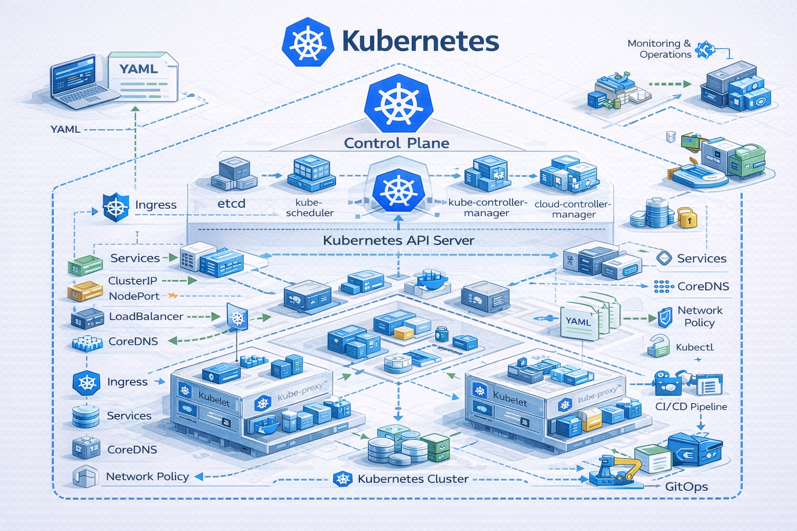

# ☸️ Kubernetes Projects Repository

  
*Professional Kubernetes projects collection for hands-on learning, architecture demos, and real-world implementations.*

---

## 🔹 Overview

This repository is a curated collection of **Kubernetes (K8s) projects** focused on **real-world use cases and production-style architectures**.
The projects are designed to help learners and engineers understand **core Kubernetes concepts** by implementing them practically rather than theoretically.
Each project demonstrates how Kubernetes components work together, including **Pods, Deployments, Services, Volumes, Configurations, and common design patterns** used in the industry.

All projects are organized into **separate folders**, each containing:
- Clear explanations
- Kubernetes manifests (YAML)
- Architecture diagrams
- Practical use cases

---

## 📂 Project List

Below is the list of Kubernetes projects included in this repository.  
New projects will be added **sequentially with numbering**.

---

### 1. **[Kubernetes Sidecar Pattern Demo](./K8s-sidecar-demo)**  
- **Description:**  
  Demonstrates the Kubernetes **Sidecar container pattern**, where a main application container shares a volume with a sidecar container responsible for log monitoring.
- The main app writes logs, and the sidecar continuously reads and processes them.
- **Key Concepts & Resources:**  
  Pods, Multi-Container Pods, Sidecar Pattern, Shared Volumes (`emptyDir`), Deployments, Services.
- **Folder:**  
  `k8s-sidecar-demo`

---

### 2. **(Upcoming Kubernetes Project)**  
- **Description:**  
  To be added.
- **Folder:**  
  TBD

---

## 🔹 How to Use

1. Clone the repository:

```bash
git clone https://github.com/<YourUsername>/kubernetes-projects.git

Navigate to the desired project directory:
cd k8s-sidecar-demo


Apply Kubernetes manifests:
kubectl apply -f k8s/


Verify resources:
kubectl get pods
kubectl get svc

Follow the project-specific README.md for detailed explanations.
